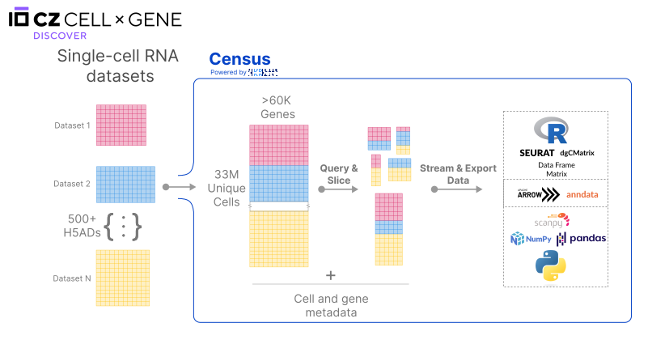

# CZ CELLxGENE Discover Census

The CZ CELLxGENE Discover Census is a computational tool that provides access, querying, and analysis capabilities for single-cell RNA data. It offers an access paradigm based on cell-based slicing and querying, allowing researchers to interact with the data efficiently. The Census is built using the SOMA API specification and data model, implemented via TileDB-SOMA. It offers data access at scale, cloud-based access, efficient access for large slices of data, and low-latency querying based on cell or gene metadata.

The Census supports interoperability with existing single-cell toolkits such as AnnData and Seurat, as well as Python and R data structures like PyArrow objects, SciPy sparse matrices, NumPy arrays, pandas data frames, R Arrow objects, sparse matrices (via the Matrix package), and standard data frames and matrices.

Check out a short video about the census [here](https://drive.google.com/file/d/17C-mHfStacrMKFTmDgY-z0T39903aCoX/view?usp=sharing)!
