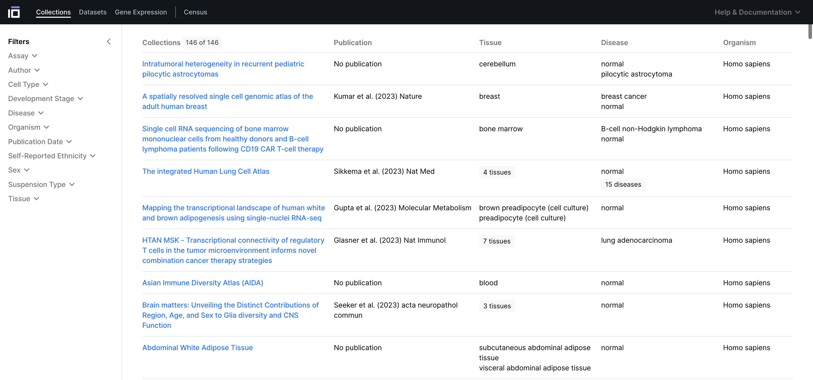

Discover single cell and spatial data
=======================
**Duration**: 20 minutes

In this module, you'll learn about the [CELLxGENE Discover Portal](https://cellxgene.cziscience.com/collections), the [Census Data Schema](https://github.com/chanzuckerberg/single-cell-curation/blob/main/schema/3.0.0/schema.md) , and how to submit your datasets to the Discover Portal. Listed below, are the learning goals for each section of this module:

  

    

      

        <!-- Content for the first card -->
        <strong>Discover Portal</strong>: 
        <ul>
            <li>Learn how to search, filter, explore, and download single cell and spatial data.</li>
            <li>Explore the corpus via collection view or dataset view.</li>
            <li>Find publication abstracts, group contact information, etc.</li>
        </ul>
      

    

  

  

    

      

        <!-- Content for the first card -->
        <strong>Census Schema</strong>: 
        <ul>
            <li>Learn about ontologies.</li>
            <li>Review key metadata fields and associated ontologies.</li>
            <li>Understand data policy and accepted data types.</li>
        </ul>
      

    

  

  

    

      

        <!-- Content for the first card -->
        <strong>Data Submission</strong>: 
        <ul>
            <li>Submission Process Overview</li>
        </ul>
      

    

  

