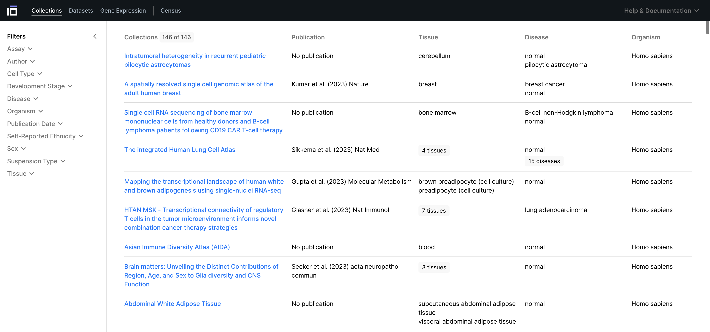

## Discover UI Overview



<!---
:::{figure-md} markdown-fig

CZ CELLxGENE Data Portal: Collections Page
:::
--->

---
### Collections
CZ CELLxGENE Discover is optimized for finding, exploring, and reusing single cell data that adhere to a standard [schema](https://github.com/chanzuckerberg/single-cell-curation/blob/main/schema/3.0.0/schema.md) that facilitates intuitive exploration and integration. The Collections Page lists the collections[^collections_note] hosted on CELLxGENE Discover and metadata that define the tissue, assay, disease, organism, and cell count for each collection. You can reach the collections page by navigating to [https://cellxgene.cziscience.com/collections](https://cellxgene.cziscience.com/collections) or by navigating to the left hand side of the page header and making sure that the collections page is selected.


[^collections_note]: i.e. collections of datasets associated with a particular publication or consortia effort


:::{figure-md} markdown-fig


<font size="3" > Select the Collections page to explore datasets by their associated publication or consortia group. </font>
:::


Collections represent groups of datasets, typically associated with either a publication or a particular consortia and are displayed as rows in a table on the center of the Collections Page. In each row, we view collection metadtata which includes the collection title (a.k.a. publication title or consortia dataset title), publication reference, the tissue(s), disease state(s), and organism profiled in the collection.

```{margin} Pro Tip
Hover over disease, tissue, and organism fields to expand the list when multiple categories (i.e. '4 tissues') of any field are present
```

:::{figure-md} markdown-fig


Collections are groups of datasets that are associated with particular publication or consortia effort. On the collections page, they are presented in a table with metadata such as Tissue, Disease, Assay, to help you gain a quick understanding of the Collection.
:::

### Datasets

:::{figure-md} markdown-fig


A nearly identical view is available for individual datasets. In addition to useful metadata fields, you also get information on the associated collection of a dataset and the ability to either download or explore it.
:::


### Filtering Collections


:::{figure-md} markdown-fig


Filters are located on the left-hand sidebar to allow you refine your search for Collections.
:::

#### Categorical filters

:::{figure-md} markdown-fig


Some filters enable a categorical selection (i.e. you can make a search for all 10X related technologies by selecting all of the 10X entries in the dropdown filter).
:::


#### Ontology based filters

:::{figure-md} markdown-fig


Metadata filters that are associated with an ontology (such as cell tye and tissue) are represented as a simplified hierarchy, curated by our team.
:::

### Filtering Datasets

:::{figure-md} markdown-fig


You can filter datasets using a similar process. The datasets page contains two additional filters based on cell count and gene count
:::

#### Numeric Filters

:::{figure-md} markdown-fig


We can set threshold on gene count using a numberic filter.
:::

### Viewing a Collection Page

:::{figure-md} markdown-fig


A collection page contains all of the key information associated with a publication or consortia.
:::


#### Abstract

:::{figure-md} markdown-fig


Abstract associated with a Collection.
:::

#### Contact Information

:::{figure-md} markdown-fig


Relevant publication information (contact, raw data store, consortia links)
:::

#### Dataset Metadata

:::{figure-md} markdown-fig


All datasets associated with a dataset are listed in a table on the Collection Page. Tissue, Disease, Orgnism, Number of Cells are all available metadata. On the right hand side of the dataset table, we have options to download or explore a chosen dataset.
:::

#### Dataset Download Dialog

:::{figure-md} markdown-fig


All datasets associated with a dataset are listed in a table on the Collection Page. Tissue, Disease, Orgnism, Number of Cells are all available metadata. On the right hand side of the dataset table, we have options to download or explore a chosen dataset.
:::

#### Dataset Explore Button

:::{figure-md} markdown-fig


All datasets associated with a dataset are listed in a table on the Collection Page. Tissue, Disease, Orgnism, Number of Cells are all available metadata. On the right hand side of the dataset table, we have options to download or explore a chosen dataset.
:::