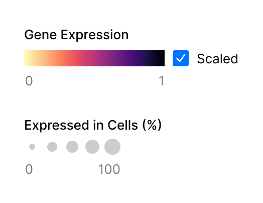
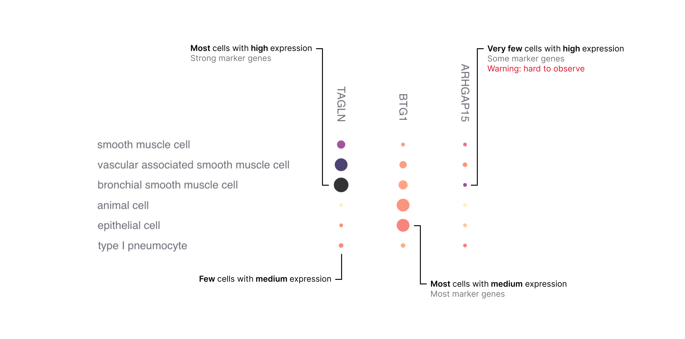
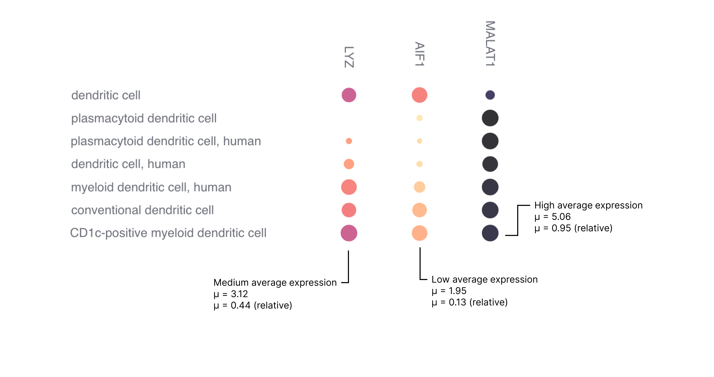

# Query and Visualize Gene Expression Across Tissues - FIX LINKS

Gene Expression is a tool that allows users to query the expression of any gene across all data in CELLxGENE Discover. A query results in a dot plot per tissue as explained below.

## How to Interpret a Gene Expression Dot Plot

### Dot Plot Basics

A dot plot can reveal gross differences in expression patterns across cell types and highlights genes that are moderately or highly expressed in certain cell types.

Dot plots visualize values across two dimensions: color and size ({numref}`gene-exp-color-scale`). The color of the dot approximates average gene expression. Its size represents the percentage of cells within each cell type that expresses the gene.

<!---
```{figure} images/DiscoverDocs/doc-site/4-2_figure1.png
---
height: 300px
name: gene-expression-figure 1
---
Here is my figure caption!
```
-->


:::{figure-md} gene-exp-color-scale


Two metrics are represented in gene expression dot plots, gene expression and percentage of expressing cells.
:::


The combination of these metrics in a grid of genes by cell types allows to make qualitative assessments of gene expression ({numref}`qualitative-assessment`).

:::{figure-md} qualitative-assessment


Types of possible qualitative assessments in a dot plot.
:::

Genes that are lowly expressed or expressed in a small percentage of cells are difficult to visually identify in a dot plot. This is particularly important for certain marker genes that are specifically but lowly expressed in their target cell types, for example transcription factors and cell-surface receptors.

### How to Make Sense of Normalized Values

The data used to create the averages for the dot plot is quantile normalized and it ranges from 0 to 6 (see "Gene Expression Data Processing" section for details).
Roughly, low expression has normalized values lower than 2, medium expression
ranges from 2 to 4, and high expression is higher than 4 (Figure 3). These
values are used for the dot plot color scheme and are constant and comparable
across different dot plots. Additionally, the user has the ability to switch to
a relative scale that maps the lowest and highest expression values in a dot
plot to the min and max colors, thus providing a wider color range for what's
shown in a dot plot.


:::{figure-md} goldilocks-expression


Examples of high, medium and low expression.
:::

The examples in {numref}`qualitative-assessment` have a relatively constant percentage of cells expressing a gene (dot size), however to identify highly expressed genes the user is advised to pay attention to both the color intensity and the size of the dot.

### How to Navigate Cell Types

Cell types in the dot plot (rows) are ordered by default with a heuristic <NextLink href="/docs/04__Analyze%20Public%20Data/4_2__Gene%20Expression%20Documentation/4_2_2__Cell%20Type%20and%20Gene%20Ordering">algorithm</NextLink> that tries to preserve relationships in the Cell Type ontology (CL).

The expressions and cell counts of parent cell type terms are <NextLink href="/docs/04__Analyze%20Public%20Data/4_2__Gene%20Expression%20Documentation/4_2_3__Gene%20Expression%20Data%20Processing">supersets</NextLink> of child terms. In other words, the expression of a gene in a parent cell type includes the expression of that gene in all its descendant cell types.

### Caveats of Normalization

Given that data are <NextLink href="/docs/04__Analyze%20Public%20Data/4_2__Gene%20Expression%20Documentation/4_2_3__Gene%20Expression%20Data%20Processing/#data-normalization">quantile normalized</NextLink> all expression is relative to the cells it is measured in. As such comparisons of absolute expression across cell types could be made if the number of genes measured is equal across all cells. While this assumption is violated, we attempt to minimize negative effects by <NextLink href="/docs/04__Analyze%20Public%20Data/4_2__Gene%20Expression%20Documentation/4_2_3__Gene%20Expression%20Data%20Processing/#removal-of-low-coverage-cells">excluding cells with low gene coverage</NextLink> thus reducing the variance in the number of genes measured across cells.

Nonetheless, caution is advised when finding subtle differences in the dot plot across cell types.

Users interested in evaluating the pre-normalized absolute expression data can access it through our <NextLink href="https://chanzuckerberg.github.io/cellxgene-census/index.html">CELLxGENE census</NextLink> API.